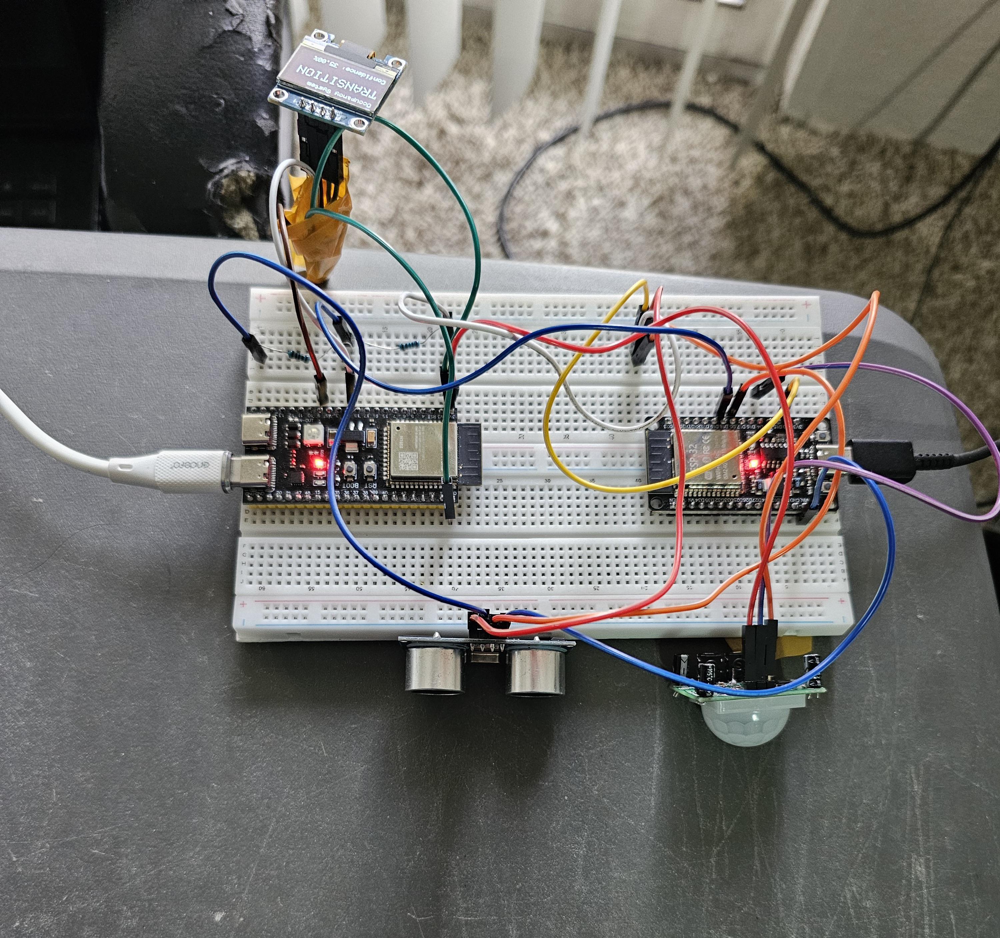
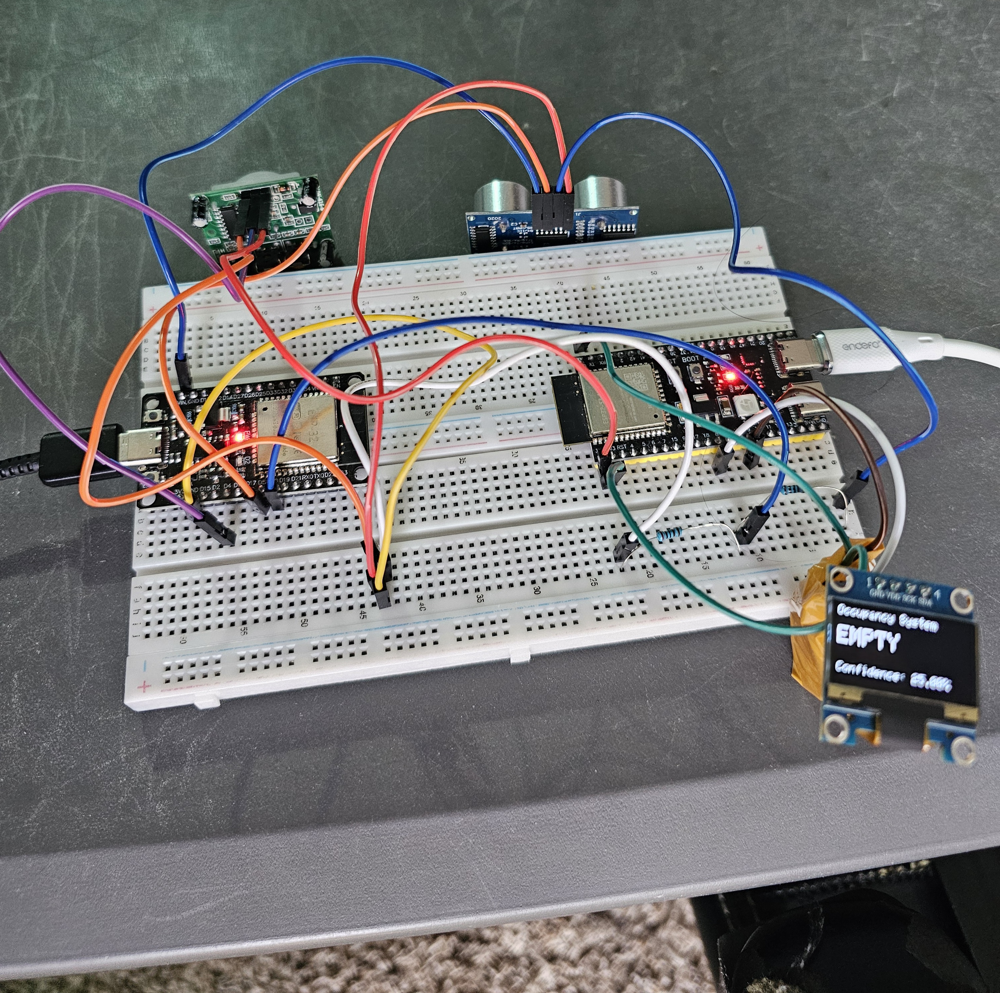
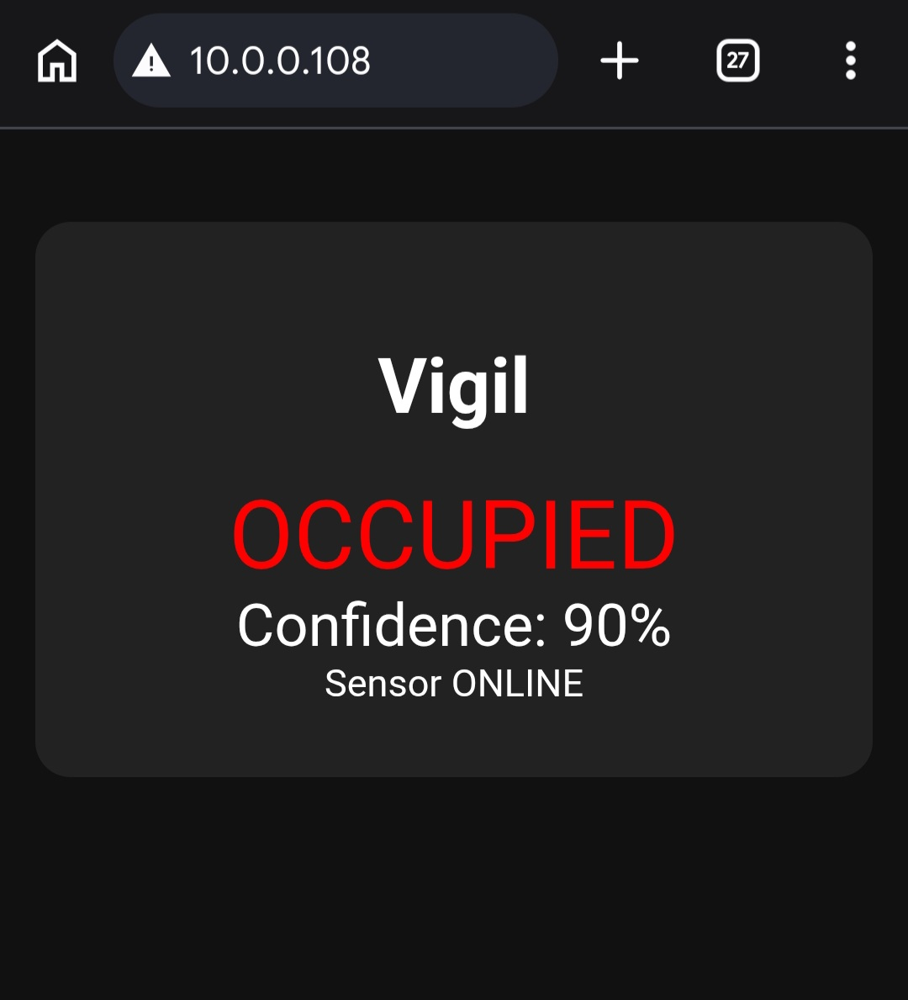
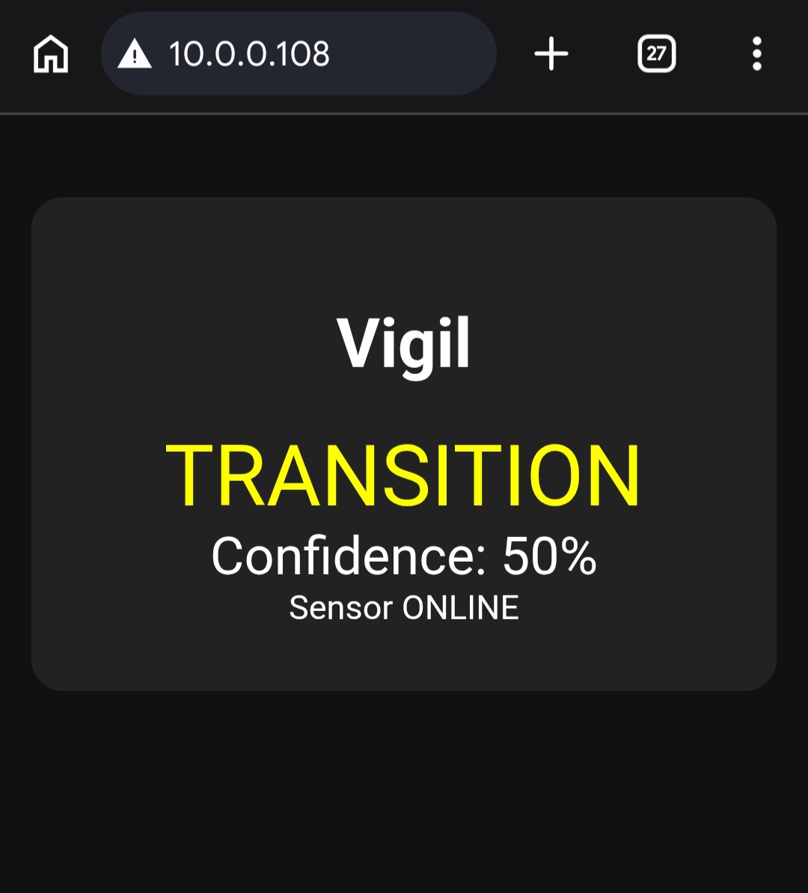
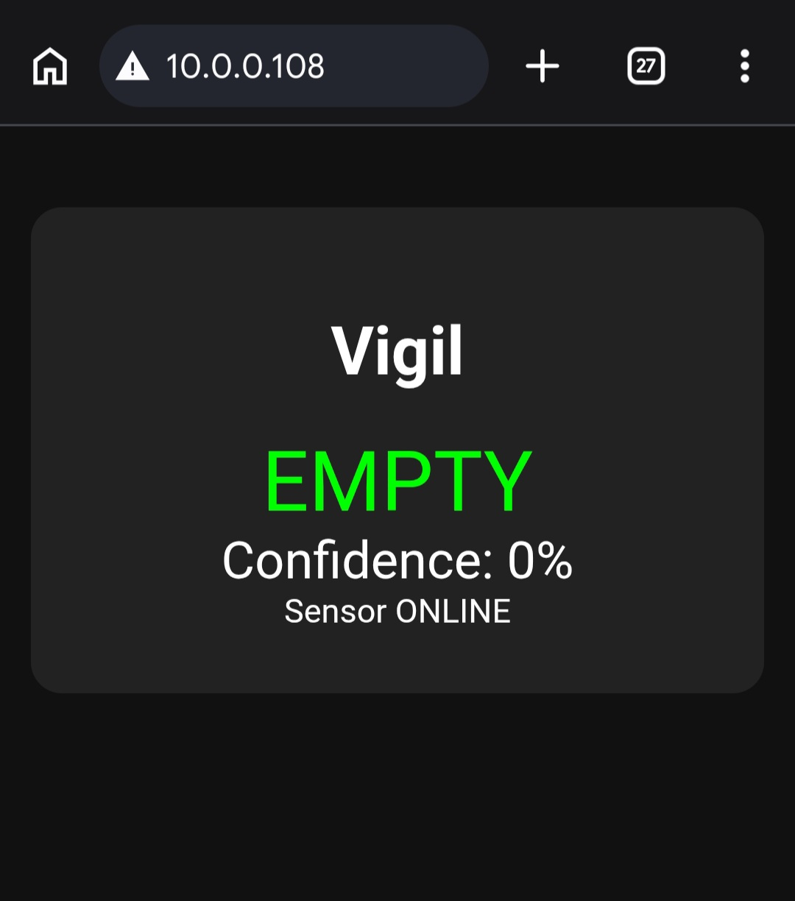

# Vigil — ESP32 Distributed IoT Occupancy Monitoring System

An ESP32-based distributed embedded IoT occupancy monitoring system using **FreeRTOS**, **sensor fusion**, **ESP-NOW wireless communication**, and a **real-time web dashboard**.

Vigil evolved from a single-node embedded occupancy detector into a **two-node distributed architecture**, separating sensing and user interaction into dedicated ESP32 devices.

---

# Overview

Vigil is a real-time occupancy monitoring system designed around modern embedded systems principles.

The system consists of two ESP32-based nodes:

- **Sensor Node (ESP32)** – Collects environmental data, performs occupancy estimation, and wirelessly transmits occupancy information.
- **Hub Node (ESP32-S3)** – Receives occupancy packets, displays the current state on an OLED display, and hosts a real-time mobile dashboard over WiFi.

The project demonstrates:

- Embedded firmware architecture
- FreeRTOS multitasking
- Sensor fusion
- Distributed embedded communication
- ESP-NOW wireless networking
- IoT dashboard development

---

# Project Evolution

## Vigil V1

The original Vigil prototype was a **single-node embedded occupancy detector**.

Features:

- ESP32
- FreeRTOS multitasking
- PIR motion sensing
- Ultrasonic distance sensing
- Confidence-based sensor fusion
- OLED display
- Mutex-protected shared data

Repository:

```
src/
```

---

## Vigil V2 (Current)

Vigil V2 transforms the system into a **distributed embedded IoT architecture**.

New additions include:

- ESP-NOW wireless communication
- Dedicated Sensor Node
- Dedicated Hub Node
- ESP32-S3 OLED Hub
- WiFi mobile dashboard
- Connection timeout detection
- Modular communication architecture

Repository:

```
Vigil_V2/

├── Vigil_Sensor/
└── Vigil_Hub/
```

---

# Demo

A complete demonstration of Vigil V2:

- Occupancy detection
- Wireless ESP-NOW communication
- OLED updates
- Mobile dashboard updates

▶ **Watch the Demo**

https://www.youtube.com/shorts/r9fqNDjZBhg

---

# Hardware

## Sensor Node

Responsible for:

- Motion detection
- Distance measurement
- Sensor fusion
- Occupancy estimation
- ESP-NOW transmission

### Hardware

- ESP32 DevKit
- HC-SR501 PIR Sensor
- HC-SR04 Ultrasonic Sensor

---

## Hub Node

Responsible for:

- ESP-NOW reception
- OLED interface
- WiFi connectivity
- Mobile dashboard

### Hardware

- ESP32-S3
- SSD1306 OLED Display

---

# Hardware Images

## Sensor Node



---

## Hub Node



---

# Mobile Dashboard

The Hub Node hosts a lightweight HTTP server that exposes the occupancy state through a mobile-friendly dashboard.

## Occupied



---

## Transition



---

## Empty



---

# Features

## Embedded Systems

- ESP32
- ESP32-S3
- FreeRTOS
- Modular C++ architecture
- Mutex-protected shared data

---

## Sensor Fusion

Occupancy estimation combines:

- PIR motion events
- Ultrasonic distance confirmation

instead of relying on a single sensor.

---

## Distributed Architecture

The project separates sensing and visualization.

```
Sensor Node
     │
     │
 ESP-NOW
     │
     ▼
Hub Node
```

This architecture allows sensing hardware to be deployed independently from the user interface.

---

## Wireless Communication

Uses **ESP-NOW** for low-latency communication between ESP32 devices.

Advantages:

- No router required between nodes
- Low latency
- Lightweight communication
- Reliable short-range wireless networking

---

## Mobile Dashboard

The Hub Node connects to WiFi and hosts an HTTP server.

Any device connected to the same network can monitor occupancy in real time.

---

## OLED Display

The Hub provides a local display showing:

- Current state
- Confidence percentage
- Connection status

---

# System Architecture

```text
                 SENSOR NODE (ESP32)

          PIR Sensor      Ultrasonic
               │              │
               └──────┬───────┘
                      │
               Sensor Fusion
                      │
          Confidence State Machine
                      │
               FreeRTOS Tasks
                      │
               ESP-NOW Sender
                      │
══════════════════════════════════════════════

                  ESP-NOW

══════════════════════════════════════════════

                 HUB NODE (ESP32-S3)

              ESP-NOW Receiver
                      │
             Occupancy Manager
                 │          │
                 │          │
              OLED      HTTP Server
                             │
                             ▼
                    Mobile Dashboard
```

---

# FreeRTOS Design

## Sensor Node

### PIR Task

Responsibilities:

- Detects motion events
- Updates motion state

Update rate:

```
100 ms
```

---

### Ultrasonic Task

Responsibilities:

- Measures distance
- Filters unstable readings
- Confirms physical presence

Update rate:

```
1000 ms
```

---

### Logic Task

Responsibilities:

- Combines sensor evidence
- Updates confidence
- Determines occupancy state
- Sends occupancy packets via ESP-NOW

---

## Hub Node

### OLED Task

Responsibilities:

- Retrieves latest occupancy packet
- Displays:

  - State
  - Confidence
  - Connection status

Update rate:

```
200 ms
```

---

# Occupancy Algorithm

Instead of switching immediately, Vigil maintains a confidence score.

Evidence:

```
PIR Motion Event

+30
```

```
Ultrasonic Presence

+20
```

Confidence naturally decays over time:

```
-5
```

State thresholds:

```
Confidence ≥ 70%

OCCUPIED
```

```
30 < Confidence < 70

TRANSITION
```

```
Confidence ≤ 30

EMPTY
```

This approach prevents rapid switching caused by temporary sensor noise.

---

# Connection Monitoring

The Hub tracks the timestamp of the last received ESP-NOW packet.

If communication is lost for more than five seconds:

```
NO_SIGNAL
```

is displayed instead of assuming the room is empty.

---

# Repository Structure

```text
Vigil/

├── README.md
├── LICENSE
│
├── src/
│   └── Vigil V1 (Original Single-Node Implementation)
│
├── Vigil_V2/
│   ├── Vigil_Sensor/
│   │
│   │   ├── Vigil_Sensor.ino
│   │   ├── ESPNowSender.*
│   │   ├── PIRSensor.*
│   │   ├── UltrasonicSensor.*
│   │   ├── Logic.*
│   │   ├── Tasks.*
│   │   ├── SharedData.h
│   │   └── SystemState.h
│   │
│   └── Vigil_Hub/
│
│       ├── Vigil_Hub.ino
│       ├── ESPNowReceiver.*
│       ├── OLEDDisplay.*
│       ├── OccupancyManager.*
│       ├── Tasks.*
│       ├── dashboard.h
│       ├── SharedData.h
│       └── SystemState.h
│
└── images/
    ├── Vigil_V2_Sensors.jpg
    ├── Vigil_V2_OLED.jpg
    ├── occupied.jpg
    ├── transition.jpg
    ├── empty.jpg
    └── Demo.mp4
```

---

# Technologies Used

Embedded Systems

- ESP32
- ESP32-S3
- FreeRTOS
- C++

Communication

- ESP-NOW
- WiFi
- HTTP Server
- I²C

Sensors

- PIR Motion Sensor
- HC-SR04 Ultrasonic Sensor

User Interface

- SSD1306 OLED
- Mobile Web Dashboard

Software Concepts

- Sensor Fusion
- Confidence-Based State Machine
- Distributed Embedded Systems
- Real-Time Multitasking
- Mutex Synchronization

---

# Future Improvements

Potential future extensions include:

- Multi-room occupancy network
- Data logging
- Historical occupancy analytics
- Industrial communication protocols (UART, SPI, RS-485)
- Battery-powered sensor nodes
- Additional environmental sensors

---

# Author

Vigil was developed as an embedded systems project exploring real-time firmware architecture, distributed wireless communication, sensor fusion, and IoT-based occupancy monitoring.
